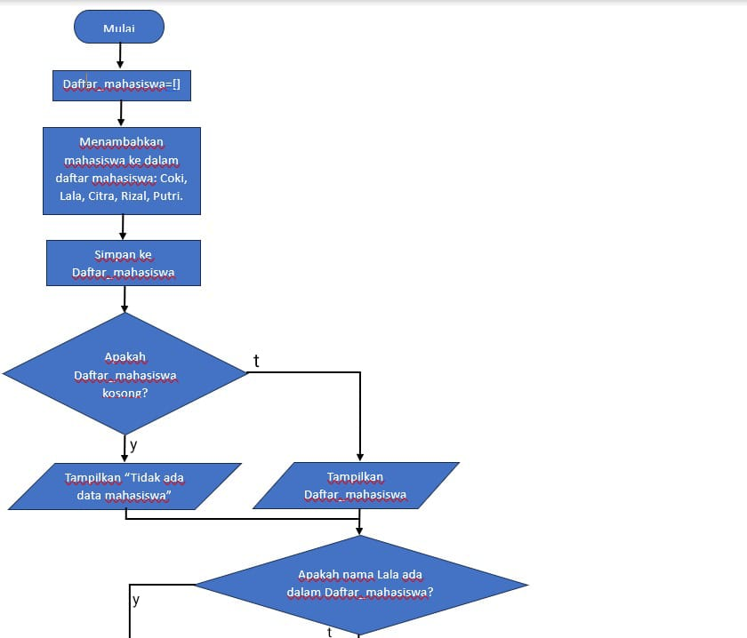
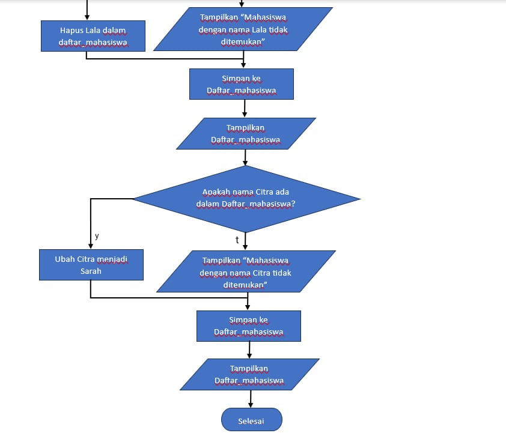

# praktikum_6

Nama: Bagus Sanjaya

NIM: 312410505

Kelas: TI.24.A.5

## Ini penjelasan dari program yang saya buat

1. Mendefinisikan Daftar:
```python
daftar_mahasiswa = []
```

Daftar kosong mahasiswa dibuat untuk menyimpan nama-nama mahasiswa.

2. Fungsi Untuk Menambah Mahasiswa:
```python
def tambah(nama):
    daftar_mahasiswa.append(nama)
    print(f"Mahasiswa dengan nama {nama} telah ditambahkan.")
```

Fungsi tambah menerima parameter nama, menambahkannya ke daftar mahasiswa, dan mencetak pesan konfirmasi.

3. Fungsi Untuk Menampilkan Mahasiswa
```python
def tampilkan():
    if daftar_mahasiswa:
        print("Daftar Mahasiswa:")
        for i, nama in enumerate(daftar_mahasiswa, 1):
            print(f"{i}. {nama}")
    else:
        print("Tidak ada data mahasiswa.")
```

Fungsi tampilkan memeriksa apakah daftar mahasiswa tidak kosong, kemudian mencetak daftar mahasiswa beserta nomor urut mereka. Jika daftar kosong, mencetak pesan bahwa tidak ada data mahasiswa.

4. Fungsi Untuk Menghapus Mahasiswa:
```python
def hapus(nama):
    if nama in daftar_mahasiswa:
        daftar_mahasiswa.remove(nama)
        print(f"Mahasiswa dengan nama {nama} telah dihapus.")
    else:
        print(f"Mahasiswa dengan nama{nama} tidak ditemukan.")
```

Fungsi hapus memeriksa apakah nama mahasiswa ada dalam daftar mahasiswa. Jika ditemukan, nama tersebut dihapus dan mencetak pesan Mahasiswa dengan nama (nama yang dihapus) telah dihapus. Jika tidak ditemukan, mencetak pesan Mahasiswa dengan nama (nama yang dihapus) tidak ditemukan.

5. Fungsi Untuk Mengubah Nama Mahasiswa:
```python
def ubah(nama_lama, nama_baru):
    if nama_lama in daftar_mahasiswa:
        index = daftar_mahasiswa.index(nama_lama)
        daftar_mahasiswa[index] = nama_baru
        print(f"Mahasiswa dengan nama {nama_lama} telah diubah menjadi {nama_baru}.")
    else:
        print(f"Mahasiswa dengan nama {nama_lama} tidak ditemukan.")
```

Fungsi ubah memeriksa apakah nama lama ada dalam daftar mahasiswa. Jika ditemukan, nama tersebut diubah menjadi nama baru dan mencetak pesan Mahasiswa dengan nama (nama lama) telah diubah menjadi (nama baru). Jika tidak ditemukan, mencetak pesan Mahasiswa dengan nama (nama lama) tidak ditemukan.

6. Contoh Penggunaan:
```python
tambah("Coki")
tambah("Lala")
tambah("Citra")
tambah("Rizal")
tambah("Putri")
tampilkan()
hapus("Lala")
tampilkan()
ubah("Citra", "Sarah")
tampilkan()
```

Baris-baris ini menunjukkan bagaimana cara menggunakan fungsi-fungsi tersebut:
- Menambah mahasiswa: Coki, Lala, Citra, Rizal, dan Putri.
- Menampilkan daftar mahasiswa.
- Menghapus Lala dari daftar mahasiswa dan menampilkan daftar mahasiswa yang telah diperbarui.
- Mengubah Citra menjadi Sarah dan menampilkan daftar mahasiswa yang telah diperbarui.

## Ini hasil/output dari program yang saya buat


## Ini penjelasan dari flowchart yang saya buat

1. Mulai.

2. Membuat sebuah list kosong bernama daftar_mahasiswa.

3. Menambahkan mahasiswa kedalam daftar mahasiswa: Coki, Lala, Citra, Rizal, Putri.

4. Lalu simpan pada list daftar_mahasiswa.

5. Apakah daftar_mahasiswa kosong?

- Jika ya, Tampilkan "Tidak ada data mahasiswa".

- Jika tidak, Tampilkan list Daftar_mahasiswa.

6. Apakah nama Lala ada dalam daftar_mahasiswa?

- Jika ya, Maka hapus Lala dalam list daftar_mahasiswa.

- Jika tidak, Maka Tampilkan "Mahasiswa dengan nama Lala tidak ditemukan".

7. Simpan data tersebut ke dalam list daftar_mahasiswa.

8. Tampilkan list daftar_mahasiswa.

9. Apakah nama Citra ada dalam dalam daftar_mahasiswa?

- Jika ya, Maka ubah Citra menjadi Sarah.

- Jika tidak, Maka Tampilkan "Mahasiswa dengan nama Citra tidak ditemukan".

10. Simpan data tersebut ke dalam list daftar_mahasiswa.

11. Tampilkan list daftar_mahasiswa.

12. Selesai.

## Ini flowchart dari program yang saya buat




