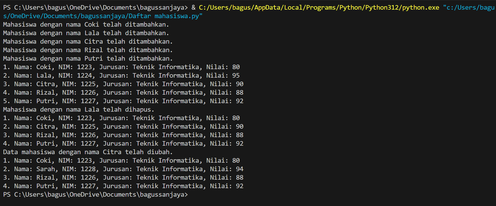
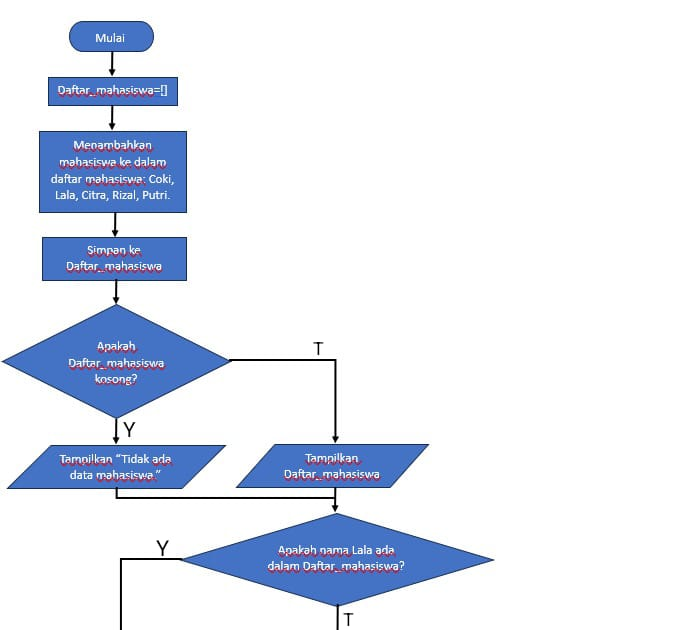
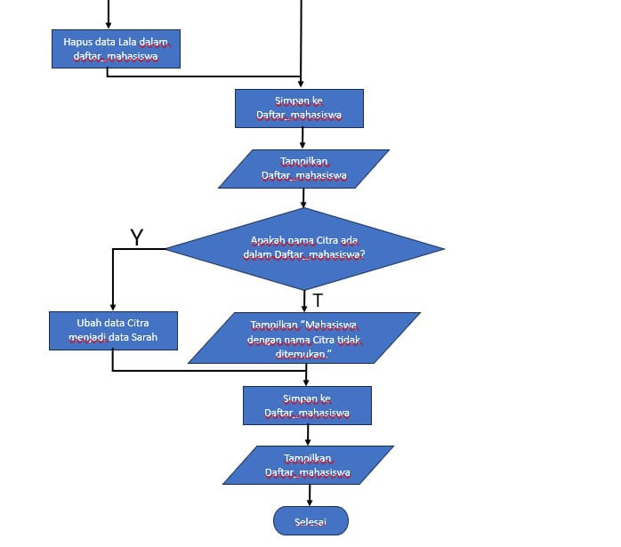

Nama: Bagus Sanjaya

NIM: 312410505

Kelas: TI.24.A.5

## Ini penjelasan dari program yang saya buat

1. Mendefinisikan Daftar:
```python
daftar_mahasiswa = []
```

Daftar kosong mahasiswa dibuat untuk menyimpan nama-nama mahasiswa.

2. Fungsi Untuk Menambah Mahasiswa:
```python
def tambah(nama, nim, jurusan, nilai):
    mahasiswa = {'nama': nama, 'nim': nim, 'jurusan': jurusan, 'nilai': nilai}
    daftar_mahasiswa.append(mahasiswa)
    print(f"Mahasiswa dengan nama {nama} telah ditambahkan.")
```

Fungsi tambah menambahkan data mahasiswa baru ke dalam daftar. Data mahasiswa disimpan sebagai dictionary dengan kunci: nama, nim, jurusan, dan nilai.

3. Fungsi Untuk Menampilkan Mahasiswa
```python
def tampilkan():
    if not daftar_mahasiswa:
        print("Tidak ada data mahasiswa.")
    else:
        for i, mahasiswa in enumerate(daftar_mahasiswa, start=1):
            print(f"{i}. Nama: {mahasiswa['nama']}, NIM: {mahasiswa['nim']}, Jurusan: {mahasiswa['jurusan']}, Nilai: {mahasiswa['nilai']}")
```

Fungsi tampilkan menampilkan semua data mahasiswa yang ada di dalam daftar. Jika daftar kosong, akan muncul pesan "Tidak ada data mahasiswa."

4. Fungsi Untuk Menghapus Mahasiswa:
```python
def hapus(nama):
    global daftar_mahasiswa
    daftar_mahasiswa = [mahasiswa for mahasiswa in daftar_mahasiswa if mahasiswa['nama'] != nama]
    print(f"Mahasiswa dengan nama {nama} telah dihapus.")
```

Fungsi hapus menghapus data mahasiswa dari daftar berdasarkan nama. Setelah dihapus, data yang tersisa akan diperbarui.

5. Fungsi Untuk Mengubah Nama Mahasiswa:
```python
def ubah(nama, nama_baru=None, nim_baru=None, jurusan_baru=None, nilai_baru=None):
    for mahasiswa in daftar_mahasiswa:
        if mahasiswa['nama'] == nama:
            if nama_baru:
                mahasiswa['nama'] = nama_baru
            if nim_baru:
                mahasiswa['nim'] = nim_baru
            if jurusan_baru:
                mahasiswa['jurusan'] = jurusan_baru
            if nilai_baru:
                mahasiswa['nilai'] = nilai_baru

            print(f"Data mahasiswa dengan nama {nama} telah diubah.")
            return
    print(f"Mahasiswa dengan nama {nama} tidak ditemukan.")
```

Fungsi ubah memungkinkan perubahan data mahasiswa berdasarkan nama. Jika nama ditemukan, data akan diperbarui sesuai parameter yang diberikan

6. Contoh Penggunaan Fungsi:
```python
tambah("Coki", "1223", "Teknik Informatika", "80")
tambah("Lala", "1224", "Teknik Informatika", "95")
tambah("Citra", "1225", "Teknik Informatika", "90")
tambah("Rizal", "1226", "Teknik Informatika", "88")
tambah("Putri", "1227", "Teknik Informatika", "92")
tampilkan()
hapus("Lala")
tampilkan()
ubah("Citra", nama_baru="Sarah", nim_baru="1228", jurusan_baru="Teknik Informatika", nilai_baru="94")
tampilkan()

```

Pada bagian ini, ditunjukkan contoh penggunaan fungsi-fungsi yang telah dibuat. Tambah data mahasiswa, tampilkan data, hapus data berdasarkan nama, dan ubah data mahasiswa.

## Ini hasil/output dari program yang saya buat



## Ini penjelasan dari flowchart yang saya buat

1. Mulai.

2. Membuat sebuah list kosong bernama daftar_mahasiswa.

3. Menambahkan mahasiswa kedalam daftar mahasiswa: Coki, Lala, Citra, Rizal, Putri.

4. Lalu simpan pada list daftar_mahasiswa.

5. Apakah daftar_mahasiswa kosong?

- Jika ya, Tampilkan "Tidak ada data mahasiswa".

- Jika tidak, Tampilkan list Daftar_mahasiswa.

6. Apakah nama Lala ada dalam daftar_mahasiswa?

- Jika ya, Maka hapus data Lala dalam list daftar_mahasiswa.

- Jika tidak, Maka lanjut ke selanjutnya.

7. Simpan data tersebut ke dalam list daftar_mahasiswa.

8. Tampilkan list daftar_mahasiswa.

9. Apakah nama Citra ada dalam dalam daftar_mahasiswa?

- Jika ya, Maka ubah data Citra menjadi data Sarah.

- Jika tidak, Maka tampilkan “Mahasiswa dengan nama Citra tidak ditemukan.”

10. Simpan data tersebut ke dalam list daftar_mahasiswa.

11. Tampilkan list daftar_mahasiswa.

12. Selesai.

## Ini flowchart dari program yang saya buat





